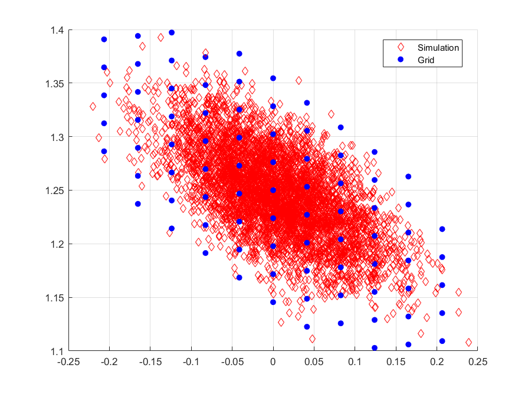

# DiscretizeVAR
Discretize VAR(1) of arbitrary size, with arbitrary covariance matrix for innovations. Support for VAR(1) with covariance matrix perturbed by common AR(1) volatility shock, 
e.g. "volatility regime," like baseline Bansal-Yaron process. Allows the elimination of support points with low probability in the ergodic distribution (non-tensor grid). 
Uses the Armadillo library for C++, with HDF5 support for I-O.

Looking instead for a MATLAB library? Consider [the code repository](https://github.com/alexisakira/discretization) for *"Discretizing Nonlinear, Non-Gaussian Markov 
Processes with Exact Conditional Moments"* by Leland E. Farmer &amp; Alexis Akira Toda, in [QE](https://onlinelibrary.wiley.com/doi/abs/10.3982/QE737).

